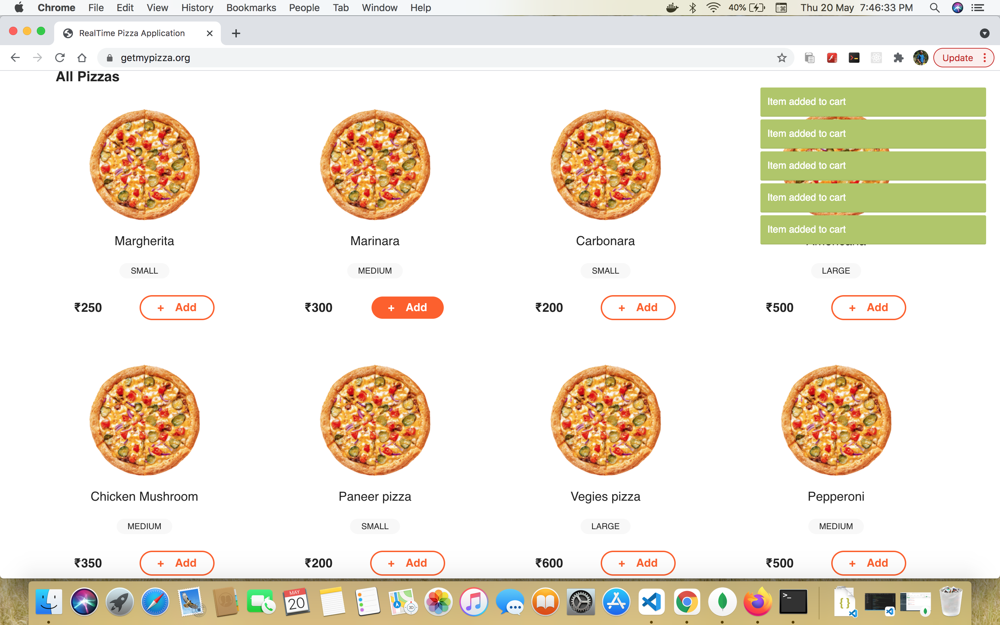
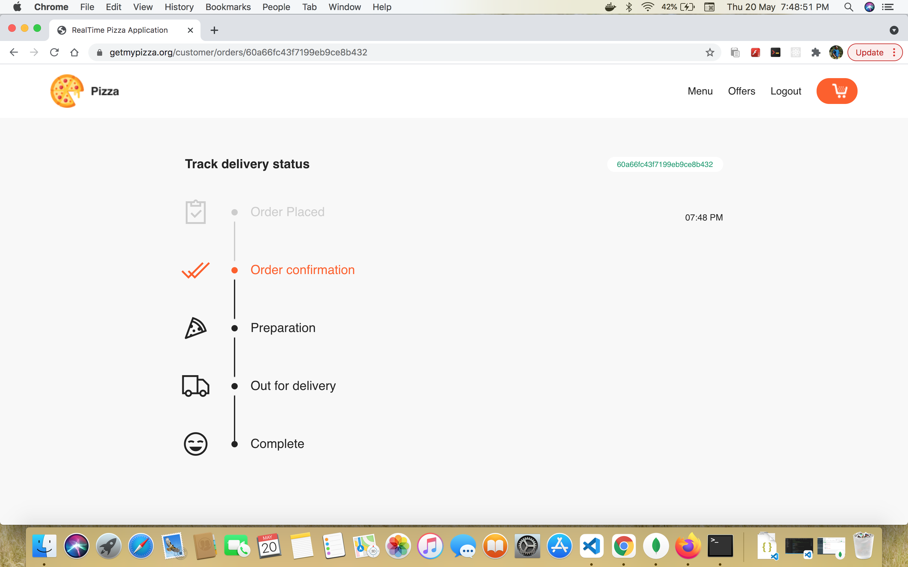

# PizzaDelieveryApplication

## Description

Realtime pizza order tracker app using NodeJs, Express and Mongo DB. Created an realtime online pizza order app using Node Js, Express Js and Mongo DB. Used tailwind css for frontend as a css framework and used EJS template engine, socket.io for realtime communication. Using This application one we will be able to order a pizza and get realtime notifications about pizza status.

## Images in Readme:

### Login Page

### Empty Cart Page

### Item Added to Cart Page

### Order Summary Page

### Admin Panel Page

### RealTime Page Update

